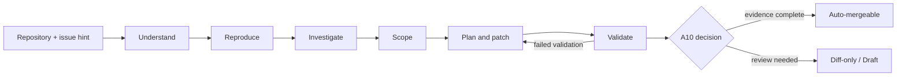
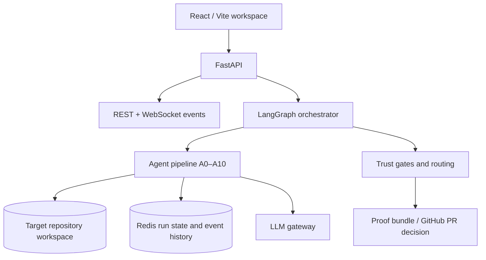

<div align="center">

# ProoFix

### Evidence before merge.

ProoFix investigates repository bugs, proposes a focused patch, and builds the evidence a reviewer needs before that patch can move toward a pull request.

[](https://www.python.org/)
[](https://fastapi.tiangolo.com/)
[](https://react.dev/)
[](https://langchain-ai.github.io/langgraph/)
[](https://redis.io/)

[Quick start](#quick-start) · [How it works](#how-it-works) · [API](#run-a-repair) · [Architecture](#architecture) · [Contributing](#contributing)

</div>

---

## The problem

A code model can produce a convincing diff in seconds. It cannot, by itself, prove that the reported bug was real, that the patch fixes the same behavior, or that the change did not introduce a regression.

ProoFix turns those questions into a workflow. Every repair carries reproduction evidence, root-cause citations, affected-file context, test results, mutation results, and a differential security scan before the system recommends a PR route.

## Problem evidence

Public research documents developer frustration with nearly correct AI output and the work required to verify generated changes. We collected the sources, their limitations, and the questions we still need to test in our [developer research notes](docs/USER_RESEARCH.md).

The notes include clearly labeled fictional scenarios from different company settings. They are not user interviews. ProoFix-specific review-time savings have not yet been measured.

## What you get

| Input | Output |
| --- | --- |
| A local repository or repository URL | A tracked repair run with live events |
| An optional issue hint | Reproduction and root-cause evidence |
| A target bug | An ordered repair plan and generated patch |
| A patch candidate | Validation results, trust axes and a proof bundle |
| A completed run | `auto_mergeable`, `diff_only`, or `draft` routing |

## Features

### Repository intelligence

- AST-backed semantic intent mapping for functions, modules and responsibilities.
- Import, caller/callee and dependency graphs for tracing how a bug travels through the codebase.
- Repository history, ownership and cached indexing to keep later stages focused on the relevant code.

### Evidence-led repair

- Reproduction checks before repair generation, with explicit status when the target environment cannot run the evidence.
- Root-cause investigation that links scanner findings, traces, tests and source citations.
- Blast-radius analysis that identifies affected files before the patch is written.
- Context engineering that gives the repair model the smallest useful evidence package instead of the whole repository.

### Controlled patching

- Fix DAG planning so dependent changes are applied in a deliberate order.
- Patch generation constrained by the plan, target files and repair context.
- Retry loops that return failed validation evidence to the patch stage with a concrete failure brief.

### Validation and review

- Target-test and regression-test validation after every candidate patch.
- Mutation testing with explicit handling for killed, survived, unavailable and stale results.
- Differential security rescanning against the pre-patch baseline.
- Mutation Certification Index (MCI) and four trust axes: Correctness, Security, Fidelity and Scope Safety.
- Proof bundles, gate traces and live run events that let a reviewer inspect how the decision was reached.

## How it works



The repair loop is deliberately evidence-first:

1. **Understand** — index the repository, parse AST structure and build dependency relationships.
2. **Reproduce** — run the target behavior and require confirmed evidence before repair work continues.
3. **Investigate** — correlate traces, scanner findings, source citations and repository history into a root cause.
4. **Scope** — calculate affected files and build focused context for the repair model.
5. **Plan and patch** — create an ordered fix DAG, then generate and apply a constrained patch.
6. **Validate** — run target and regression tests, mutation validation, and a baseline-vs-post-patch security rescan.
7. **Route** — verify description/diff fidelity, calculate trust axes, and choose the safest PR outcome.

## What makes ProoFix different

| Typical repair workflow | ProoFix |
| --- | --- |
| Starts with an LLM-generated edit | Starts by checking whether the reported behavior can be reproduced |
| Sends broad repository context to one model | Builds semantic, dependency and blast-radius context in separate stages |
| Treats a passing test as enough evidence | Combines target tests, regression tests and mutation behavior |
| Runs security tooling as an unrelated final check | Compares baseline and post-patch findings to identify what the patch introduced |
| Returns a diff and a confidence label | Returns a diff, citations, validation evidence, gate trace and routing decision |
| Hides unavailable tools behind defaults | Preserves `null` for missing measurements; absent evidence cannot pass a gate |
| Assumes automation should always merge | Keeps `diff_only` and `draft` as explicit, explainable review paths |

The key design choice is that **the patch is not the product**. The product is a patch plus enough inspectable evidence for another engineer to decide whether it should move forward. Agents have separate responsibilities, failed validation returns to patch generation, and humans retain control whenever the evidence is incomplete or contradictory.

## Trust model

A10 exposes four axes on a 0–100 scale:

| Axis | Evidence behind it |
| --- | --- |
| **Correctness** | Target/regression tests and mutation score |
| **Security** | Newly introduced findings after baseline reconciliation |
| **Fidelity** | Agreement between the repair description, citations and actual diff |
| **Scope Safety** | Blast graph and files requiring human review |

**Trust** is the mean of measured axes. A missing measurement is `null` and is excluded from the arithmetic; a measured zero remains a real result. The UI returns the composite on a 0–1 scale (`0.97` = 97%). These are evidence summaries, not formal proofs of program correctness. Scope Safety is intentionally a heuristic and should be read with the blast graph and hard-gate trace.

## Architecture



### Agent map

| Stage | Code | Job |
| --- | --- | --- |
| A0/A0.5 | `repository_intelligence.py` | Repository indexing, caching and knowledge graph |
| A0.7 | `a0_7_environment.py` | Target environment and test-runner precheck |
| A1 | `a1_semantic_mapper.py` | AST-backed semantic intent mapping |
| A2 | `a2_dependency_analyzer.py` | Import and caller/callee relationships |
| A3 | `a3_static_analysis.py` | Baseline security and quality scan |
| A3.5 | `a3_5_reproduction.py` | Reproduction execution and stability evidence |
| A4 | `a4_evidence_investigator.py` | Evidence correlation and root-cause analysis |
| A5 / A5.5 | `a5_blast_graph.py`, `a5_5_context_engineering.py` | Blast radius and repair context |
| A6 | `a6_fix_dag_planner.py` | Ordered modification plan |
| A7 | `a7_code_generation.py` | Patch generation and application |
| A8 | `a8_mutation_validator.py` | Tests and mutation validation |
| A9 | `a9_security_rescan.py` | Differential post-patch security scan |
| A10 | `a10_mci_scorer.py`, `a10_routing.py` | Fidelity, trust gates and PR routing |

## Quick start

### Requirements

- Python 3.11+
- Node.js and npm
- Redis 7+ (local or Docker)
- An LLM provider, or stub mode for local smoke tests

### 1. Install the backend

```bash
git clone https://github.com/CHEZHIYAN0277/Proofix.git
cd Proofix
python -m venv .venv
source .venv/bin/activate                 # Windows: .venv\\Scripts\\activate
pip install -e ".[dev]"
cp .env.example .env
```

For semantic NLP features, install the optional spaCy model:

```bash
python -m spacy download en_core_web_sm
```

### 2. Start Redis and the API

```bash
docker compose up -d redis
uvicorn backend.main:app --reload --host 127.0.0.1 --port 8000
```

For a credential-free smoke test, set `STUB_MODE=true` in `.env`. For real patch generation, configure the provider selected by `LLM_PROVIDER` and its server-side key or local endpoint.

### 3. Start the workspace

```bash
cd frontend
npm install
npm run dev
```

Open <http://localhost:5173>.

## Run a repair

Create a run with a local path or repository URL:

```bash
curl -X POST http://127.0.0.1:8000/runs \
  -H 'Content-Type: application/json' \
  -d '{"repo_path":"/absolute/path/to/target-repository","issue_hint":"describe the bug to investigate"}'
```

Then inspect the run:

```bash
curl http://127.0.0.1:8000/runs/<run_id>
curl http://127.0.0.1:8000/runs/<run_id>/events
```

Live updates are available at `ws://127.0.0.1:8000/ws/runs/<run_id>`. The API also exposes UI projections under `/api` and proof bundles under `/runs/<run_id>/proof/<issue_id>`.

## Repository map

```text
backend/       FastAPI app, agents, orchestrator, models, services and security
frontend/      React/Vite workspace
docs/           API contracts, workflow notes and proof examples
 tests/        Unit and integration tests
pyproject.toml Python package and test configuration
.env.example   Environment reference
```

## Verify locally

```bash
# Backend
pytest -q

# Frontend
cd frontend
npm test
npm run build
npm run lint
```

The validation pipeline uses Pytest, Mutmut, Bandit, Ruff and Semgrep when available in the target environment. Scanner availability is surfaced in the result; it is never silently converted into a passing security measurement.

## Safety notes

- Keep provider credentials, GitHub tokens and speech keys in the backend environment.
- Keep `GITHUB_DRY_RUN=true` while developing.
- Repository commands use guarded subprocess helpers, path checks and filtered environments. For hosted execution of untrusted repositories, add OS-level sandboxing.
- A patch cannot be considered merge-ready without confirmed reproduction, passing target and regression tests, measured correctness and security, and no phantom changes.
- Draft and diff-only outcomes are expected review paths, not errors.

## Documentation

- [`docs/WORKFLOW.md`](docs/WORKFLOW.md) — end-to-end workflow
- [`docs/TRUST_GATING.md`](docs/TRUST_GATING.md) — routing and hard gates
- [`docs/V1_API_DATA_CONTRACT.md`](docs/V1_API_DATA_CONTRACT.md) — API and state contract
- [`docs/PRODUCTION_CERTIFICATION.md`](docs/PRODUCTION_CERTIFICATION.md) — deployment checks
- [`docs/KNOWLEDGE_GRAPH.md`](docs/KNOWLEDGE_GRAPH.md) — repository graph model

## Contributing

1. Create a focused branch.
2. Keep changes scoped to one behavior or agent contract.
3. Add or update meaningful tests for behavior changes.
4. Run the backend and frontend checks before opening a pull request.
5. Include evidence for changes that affect routing, validation or security.

## License

This project is intended to be released under the MIT License.
