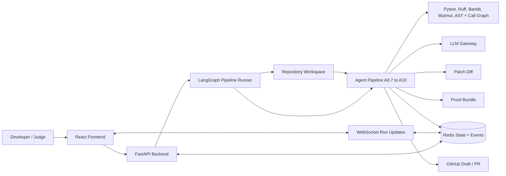
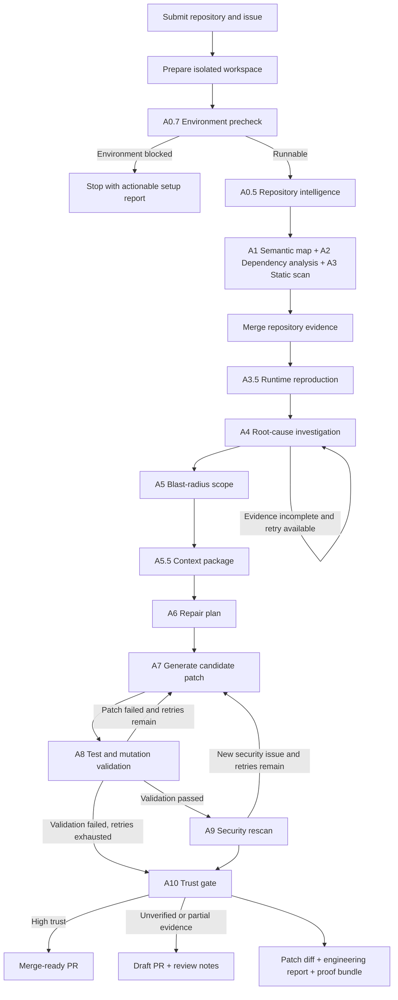

# ProoFix Documentation Starter

This document is a starting point for writing clear project documentation for ProoFix. It is written for hackathon judges first and developers second, so it should explain the product quickly, then prove that the implementation is real.

## How To Make Project Documentation

Good documentation answers five questions in order:

1. What problem does this project solve?
2. Who uses it?
3. What does the system do from input to output?
4. How does someone run it and verify it?
5. What is implemented now, and what is planned next?

For a hackathon project, avoid making the documentation look like a research paper. Judges usually skim first. Your first screen should make the project understandable without needing the PPT or demo video.

Recommended documentation files:

| File | Purpose |
| --- | --- |
| `README.md` | Main public entry point: problem, solution, quick start, demo, architecture, proof of working behavior |
| `docs/ARCHITECTURE.md` | System components and how backend, frontend, storage, agents, and external tools interact |
| `docs/WORKFLOW.md` | Step-by-step pipeline from repository input to PR/proof bundle |
| `docs/SETUP.md` | Local setup, environment variables, Redis/backend/frontend commands |
| `docs/DEMO.md` | Exact demo scenario, expected output, screenshots, limitations |
| `docs/LIMITATIONS.md` | Honest current boundaries, known failures, and future work |

If time is short, make only three files first: `README.md`, `docs/ARCHITECTURE.md`, and `docs/WORKFLOW.md`.

## How To Document ProoFix

ProoFix should be documented around one simple story:

> ProoFix takes a repository, investigates a bug or security issue, generates a candidate patch, validates it with tests and security checks, and then produces a draft or merge-ready pull request with evidence.

Use this order in the README:

1. Project name and one-line pitch.
2. Short problem statement.
3. What ProoFix does.
4. One successful demo scenario.
5. Architecture diagram.
6. Workflow diagram.
7. Setup instructions.
8. Validation evidence.
9. Current limitations.
10. Roadmap.

The most important change from your current public materials is honesty of claim. Do not say every fix is proven unless the demo actually shows passing reproduction, validation, mutation, and security results. Say "candidate fix with evidence-based trust gating" when the result is draft or partially verified.

## Architecture Diagram Review

You can use the current architecture diagram, but not as the main documentation diagram.

It is useful as a detailed appendix because it shows many real ProoFix layers: repository input, semantic mapping, static analysis, runtime reproduction, root-cause investigation, context engineering, repair, validation, trust assurance, and developer deliverables.

For the main README or PPT, change it. The current image has these problems:

| Issue | Why It Hurts |
| --- | --- |
| Too much visual detail | Judges cannot understand the system in 10-20 seconds |
| Too many icons | The icons look impressive but do not explain the data flow clearly |
| Layer names mix architecture and workflow | Architecture should show system components; workflow should show process order |
| Important implementation pieces are missing | Frontend, FastAPI backend, Redis state store, GitHub PR service, WebSocket events, LLM gateway, and proof bundle storage should be visible |
| Arrows are hard to follow | A reader cannot easily tell the exact order from repository input to output |
| Some labels overclaim | Use "candidate patch", "draft PR", "trust gate", and "evidence bundle" unless the run is fully validated |

Recommendation:

Use two diagrams:

1. A simple architecture diagram for "what components exist".
2. A workflow diagram for "what happens step by step".

Keep the current image as an appendix named "Detailed Agent Layer Diagram".

## Suggested Architecture Diagram

Use this in `docs/ARCHITECTURE.md` or the README:

This diagram is better for documentation because it separates the product system from the internal agent sequence.

## Suggested Workflow Diagram

Use this in `docs/WORKFLOW.md`, README, and PPT:

This workflow matches the current backend graph more closely than the big image.

## What To Write In Each Main Section

### Problem

Developers increasingly use AI coding tools, but many tools generate patches without proving that the bug was reproduced, the root cause was understood, or the fix was validated. This creates risk: wrong files may be edited, regressions may be introduced, and reviewers get little evidence.

### Solution

ProoFix is a multi-agent repair pipeline that analyzes a repository, gathers static and runtime evidence, plans a scoped repair, generates a candidate patch, validates it, and routes the result through trust gates before creating a PR or proof bundle.

### Current Capability

Use careful wording:

- Repository analysis using AST, dependency, and static-security signals.
- Runtime reproduction using the target repository's tests.
- Root-cause investigation with evidence citations.
- Blast-radius and context selection before patching.
- Candidate patch generation.
- Validation using tests, mutation checks where available, and post-patch security scanning.
- Trust-gated PR routing into merge-ready or draft mode.

Avoid these claims unless you have a fresh successful demo proving them:

- "Always proven fix"
- "100 percent evidence provenance"
- "10/10 reproduction for every bug"
- "Zero unsandboxed execution risk"
- "Fully autonomous production-ready repair"

### Demo Evidence

For hackathon documentation, include one table like this:

| Evidence | What To Show |
| --- | --- |
| Input repo | Repository URL/path and commit hash |
| Bug | Short issue statement |
| Failing test before patch | Command and failing output |
| Patch | File changed and short diff |
| Passing test after patch | Same command passing |
| Regression check | Full or scoped test result |
| Security check | New findings: yes/no |
| Trust decision | Merge-ready PR or draft PR with reason |

This table will help more than another large architecture image.

## Documentation Build Order

Do the documentation in this order:

1. Fix the project behavior for one strong demo case.
2. Update README to match that exact demo.
3. Add `docs/ARCHITECTURE.md` with the simplified architecture diagram.
4. Add `docs/WORKFLOW.md` with the workflow diagram.
5. Add screenshots from the successful run.
6. Update PPT only after the README and demo are consistent.

The project does not need more complexity right now. It needs one clean, believable path from problem to proof.

