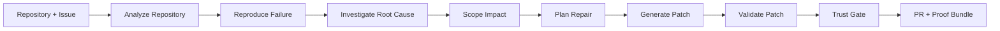
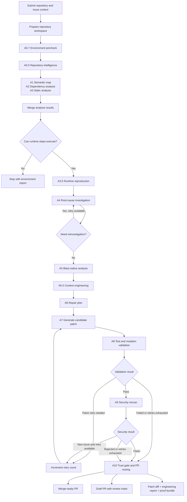

# ProoFix Workflow

ProoFix follows an evidence-first repair workflow. The system does not jump directly from a prompt to a patch. It first prepares the repository, gathers static and runtime evidence, investigates the root cause, scopes the repair, generates a candidate patch, validates it, and then routes the result through a trust gate.

## PPT Workflow Diagram

Use this version in hackathon slides. It is simple enough for judges to understand quickly.

Recommended slide caption:

> ProoFix turns a repository issue into a trust-gated repair by combining agent reasoning with repository evidence, test execution, mutation checks, and security validation.

## Detailed Project Workflow

Use this version in documentation. It matches the current backend orchestration flow more closely.

## Workflow Stages

| Stage | What Happens | Output |
| --- | --- | --- |
| Repository input | User submits a local repository or cloud repository with issue context | Workspace path and run state |
| Environment precheck | Checks whether runtime validation can execute | Runnable verdict or environment report |
| Repository intelligence | Builds repository-level understanding and cached knowledge | Repository index and graph signals |
| Static analysis | Agents inspect code structure, dependencies, and security signals | Semantic map, dependency report, static findings |
| Runtime reproduction | Executes tests to observe the failure when possible | Test command, logs, failure status |
| Root-cause investigation | Correlates runtime, static, and source evidence | Root-cause brief and evidence report |
| Blast-radius analysis | Finds affected files and downstream impact | Repair scope |
| Context engineering | Packages the relevant code and evidence for repair | Focused context package |
| Repair planning | Converts evidence into an ordered repair plan | Fix plan |
| Patch generation | Generates a candidate patch | Patch diff |
| Validation | Runs targeted tests, regression checks, and mutation checks where available | Validation result |
| Security rescan | Checks whether the patch introduced new issues | Security verdict |
| Trust gate | Routes result based on evidence and validation | Merge-ready PR, draft PR, or proof bundle |

## What To Say In The PPT

Use this short explanation:

> ProoFix uses a LangGraph-based workflow where every agent updates a shared evidence state. The system first understands the repository, then reproduces or observes the issue, investigates the root cause, scopes the safe repair area, generates a candidate patch, and validates it. The final trust gate decides whether the fix can be proposed as merge-ready or should remain a draft for human review.

## Diagram Notes

For slides, use the short left-to-right diagram. For GitHub documentation, use the detailed top-to-bottom diagram.

Keep the wording careful:

- Say "candidate patch" until validation passes.
- Say "draft PR" when reproduction or validation evidence is incomplete.
- Say "merge-ready" only when the required validation and trust gates pass.
- Say "proof bundle" for the evidence package that helps reviewers inspect the repair.

